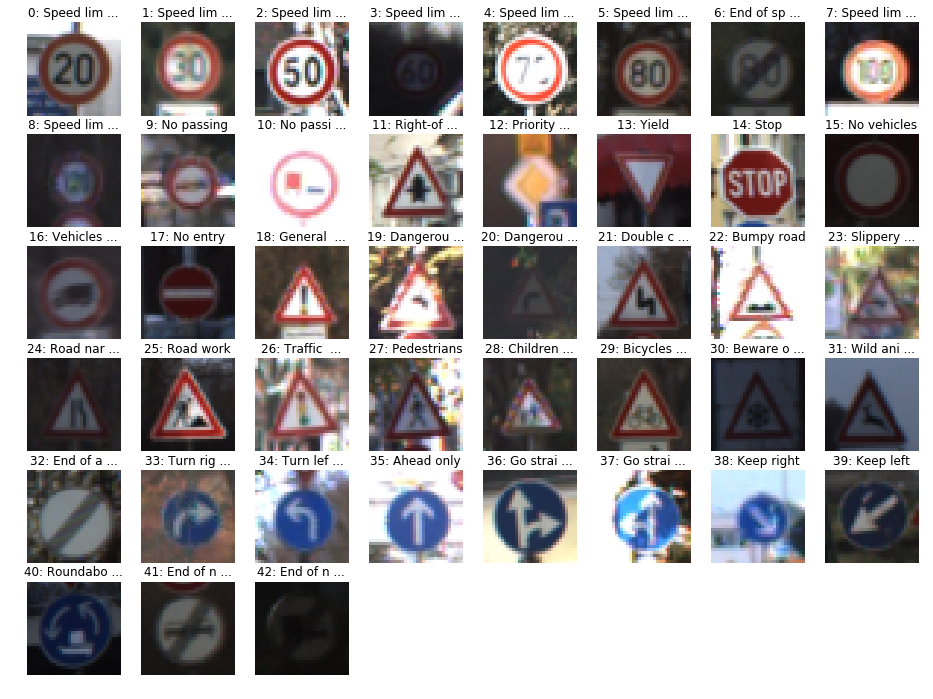

# **Traffic Sign Recognition** 

---

**Build a Traffic Sign Recognition Project**

The goals / steps of this project are the following:
* Load the data set (see below for links to the project data set)
* Explore, summarize and visualize the data set
* Design, train and test a model architecture
* Use the model to make predictions on new images
* Analyze the softmax probabilities of the new images
* Summarize the results with a written report

**Here is a link to my [project code](https://github.com/sibuzu/CarND-Traffic-Sign-Classifier-Project/blob/master/Traffic_Sign_Classifier.ipynb)**

### Data Set Summary & Exploration

#### 1. Basic summary of the data set. 

I used the pandas library to calculate summary statistics of the traffic
signs data set:

* The size of training set is 34799
* The size of the validation set is 4410
* The size of test set is 12630
* The shape of a traffic sign image is (32, 32, 3)
* The number of unique classes/labels in the data set is 43

#### 2. Exploratory visualization of the dataset.

Here is an exploratory visualization of the data set. It is a bar chart showing how the data distribute.

Min number of images per class = 180 
Max number of images per class = 2010

The first image of each class is shown here.

### Design and Test a Model Architecture

#### 1. Preprocessing the image data. 

I thought color informtion was important in traffic sign recogition.  
As a first step, I decided to convert the images into YUV domain spaces.
Here is an example of a traffic sign image before and after converted.

Then, I normalized the image data into range from -0.5 to +0.5.  The luminance of these images are quite difference.  
I found the maximum and minumun values of each image and then scaled the image into range from -0.5 to +0.5.

#### 2. Describe what your final model architecture looks like including model type, layers, layer sizes, connectivity, etc.) Consider including a diagram and/or table describing the final model.

My final model consisted of the following layers:

| Layer         		|     Description	        					| 
|:---------------------:|:---------------------------------------------:| 
| Input         		| 32x32x3 YUV image   							| 
| Convolution 5x5     	| 1x1 stride, valid padding, outputs 28x28x18 	|
| RELU					|												|
| Max pooling	      	| 2x2 stride,  outputs 14x14x18 				|
| Convolution 5x5     	| 1x1 stride, valid padding, outputs 10x10x48 	|
| RELU					|												|
| Max pooling	      	| 2x2 stride,  outputs 5x5x48 					|
| Flatten   	      	| outputs 1200 									|
| Fully connected		| outputs 360 									|
| RELU					|												|
| Fully connected		| outputs 252									|
| RELU					|												|
| Fully connected		| outputs 43									|
| Softmax				|												|

The first architecture that was tried is original LeNet for MNIST recogintion. Its first convolution depth is 6 and the second convolution depth is 16.  However, the accuracy is not well.  I thought it is because MNIST is grayscale which has only one channel and our image is YUV image has three channels.  Besides, MNIST has only 10 classes but the traffic sign has 43 classes.  I decided to extend the depth of the two convolution layes to 3 times and the nodes numbers of the full connected layers to 3 times too.   I trained this model, and luckily the trained result met the project requirement.

#### 3. Describe how you trained your model. The discussion can include the type of optimizer, the batch size, number of epochs and any hyperparameters such as learning rate.

I used AdamOptimizer as my optimizer, which was always a good choice for the first try.
The batch size and the learning rate were typical values.  The batch size I used was 128. The learning rate was 0.001. 
The number of epochs I run was 30.  The accuracy is almost converged after 20 epochs.

#### 4. Describe the approach taken for finding a solution and getting the validation set accuracy to be at least 0.93. Include in the discussion the results on the training, validation and test sets and where in the code these were calculated. Your approach may have been an iterative process, in which case, outline the steps you took to get to the final solution and why you chose those steps. Perhaps your solution involved an already well known implementation or architecture. In this case, discuss why you think the architecture is suitable for the current problem.

My final model results were:
* training set accuracy of 1.000
* validation set accuracy of 0.956
* test set accuracy of 0.949

### Test a Model on New Images

#### 1. Choose five German traffic signs found on the web and provide them in the report. For each image, discuss what quality or qualities might be difficult to classify.

Here are five German traffic signs that I found on the web:

The NO_LEFT image should be failed to classified because our dataset don't have this catalogry.  
The LIMIT40 image might be failed too because our dataset has catalogies of "Speed limit (30km/h)" and "Speed limit (50km/h)".  But it has no exact catalogy of "Speed limit (40km/h)".  However, I hoped that the classifer could classify this image as "Speed limit" sign.

#### 2. Discuss the model's predictions on these new traffic signs and compare the results to predicting on the test set. At a minimum, discuss what the predictions were, the accuracy on these new predictions, and compare the accuracy to the accuracy on the test set (OPTIONAL: Discuss the results in more detail as described in the "Stand Out Suggestions" part of the rubric).

Here are the results of the prediction:

| Image			        |     Prediction	        					| 
|:---------------------:|:---------------------------------------------:| 
| YIELD					| Yield											| 
| NO_LEFT     			| Speed limit (70km/h)							|
| LIMIT40				| General caution								|
| STOP 					| Stop							 				|
| CHILD_CROSS			| Children crossing								|

The model was able to correctly guess 3 of the 5 traffic signs, which gives an accuracy of 60%.

#### 3. Describe how certain the model is when predicting on each of the five new images by looking at the softmax probabilities for each prediction. Provide the top 5 softmax probabilities for each image along with the sign type of each probability. (OPTIONAL: as described in the "Stand Out Suggestions" part of the rubric, visualizations can also be provided such as bar charts)

SIGN YIELD:
  * [100.00%] class 13: Yield
  * [0.00%] class 35: Ahead only
  * [0.00%] class 25: Road work
  * [0.00%] class 22: Bumpy road
  * [0.00%] class 12: Priority road

SIGN NO_LEFT:
  * [93.98%] class 4: Speed limit (70km/h)
  * [3.30%] class 40: Roundabout mandatory
  * [2.72%] class 39: Keep left
  * [0.00%] class 2: Speed limit (50km/h)
  * [0.00%] class 1: Speed limit (30km/h)

SIGN LIMIT40:
  * [96.76%] class 18: General caution
  * [3.18%] class 19: Dangerous curve to the left
  * [0.06%] class 27: Pedestrians
  * [0.00%] class 9: No passing
  * [0.00%] class 41: End of no passing

SIGN STOP:
  * [99.97%] class 14: Stop
  * [0.02%] class 12: Priority road
  * [0.00%] class 1: Speed limit (30km/h)
  * [0.00%] class 13: Yield
  * [0.00%] class 32: End of all speed and passing limits

SIGN CHILD_CROSS:
  * [100.00%] class 28: Children crossing
  * [0.00%] class 11: Right-of-way at the next intersection
  * [0.00%] class 18: General caution
  * [0.00%] class 23: Slippery road
  * [0.00%] class 41: End of no passing

  
The classifier did a very good job on sign YIELD, STOP, and CHILD_CROSS.  It classified them correctly with very high confidence. It cannot classify the image NO_LEFT as expected.  However the predicted image "Speed limit (70km/h)" is similar to the classified image in some sense.  But the image LIMIT40 made our classifier crazy. The top 5 classes with maximum probability don't include any "Speed limit" and are not similar to the classified image in our human sense.

### (Optional) Visualizing the Neural Network (See Step 4 of the Ipython notebook for more details)
#### 1. Discuss the visual output of your trained network's feature maps. What characteristics did the neural network use to make classifications?

The visualizing results show as follows.  The first convolution layer seems to empythize some edge or corner features.  The second convlution layer tries to combine or convolve the first layer.  So each point of the visualizing results should represt a more complex struture of the image.  However, we cannot intuitively to know which structure it represents in the second layer visualization result.

=== Original Image ===

=== Visualize the first convolution layer ===

=== Visualize the second convolution layer ===

